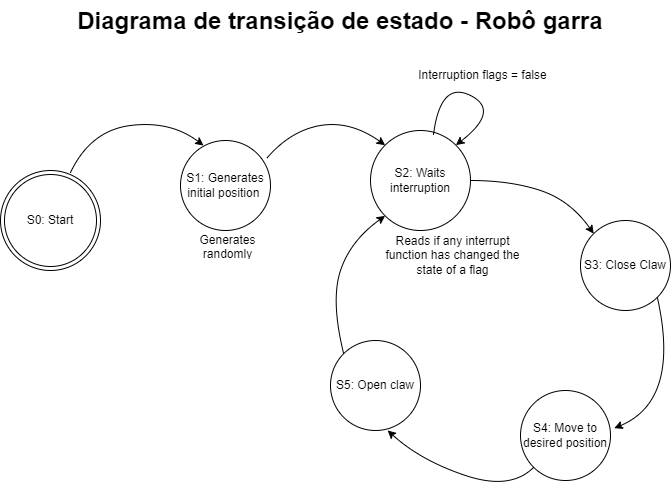

# 🤖 Robo-garra

Projeto desenvolvido para simular o comportamento de um robô com garra utilizando um ESP32, display LCD 2004 e três botões de controle. A atividade foi voltada ao estudo e prática do uso de **funções de interrupção** em sistemas embarcados.

## 🎯 Objetivo

O principal objetivo desta atividade é implementar o controle de um Robo carro-garra simulado por meio de **interrupções na leitura de botões**. Cada botão representa uma posição específica que o robô deve alcançar. O fluxo de operação é o seguinte:

1. O botão é pressionado, acionando uma interrupção.
2. O robô realiza o **fechamento da garra**.
3. O robô "move-se" até a posição correspondente (representada no display).
4. Quando chega ao destino, realiza a **abertura da garra**.

O sistema é uma simulação, onde tanto o movimento quanto a ação da garra são representados por desenhos exibidos no **display LCD 2004**.

## 🧰 Tecnologias e Ferramentas

- **ESP32**
- **Linguagem C++**
- **Display LCD 2004**
- **PlatformIO** com extensão no **Visual Studio Code**
- **Simulador wokwi.com** para teste e validação do circuito

## 🔧 Como executar o projeto

1. Clone este repositório:
   ```bash
   git clone https://github.com/seu-usuario/Robo-garra.git
   cd Robo-garra
   ```

2. Abra o projeto no Visual Studio Code com a extensão **PlatformIO** instalada.

3. Compile e envie o código para o ESP32 conectado, ou rode a simulação diretamente no [Wokwi](https://wokwi.com/):
   
   - Certifique-se de que o ESP32 e o LCD estão corretamente conectados conforme o código.

## 🧪 Funcionalidades Simuladas

- 📍 Três posições de destino simuladas no LCD.
- 🔘 Interrupções por botão para selecionar a posição.
- ✊ Ações de "fechar" e "abrir" a garra representadas no display.
- 🛑 Abertura da garra somente após o "movimento" completo.

## 📷 Imagem
Esquema do sistema simulado:
> 

Diagrama de transição de estados:




## 📚 Aprendizados

- Uso de **interrupções por hardware** em microcontroladores.
- Prática com **displays LCD**.
- Simulação de lógica robótica com dispositivos simples.
- Integração do **PlatformIO** com o ESP32 e ambientes simulados.

---

💡 **Sinta-se à vontade para sugerir melhorias, abrir issues ou fazer forks para adaptar esse projeto às suas necessidades!**
